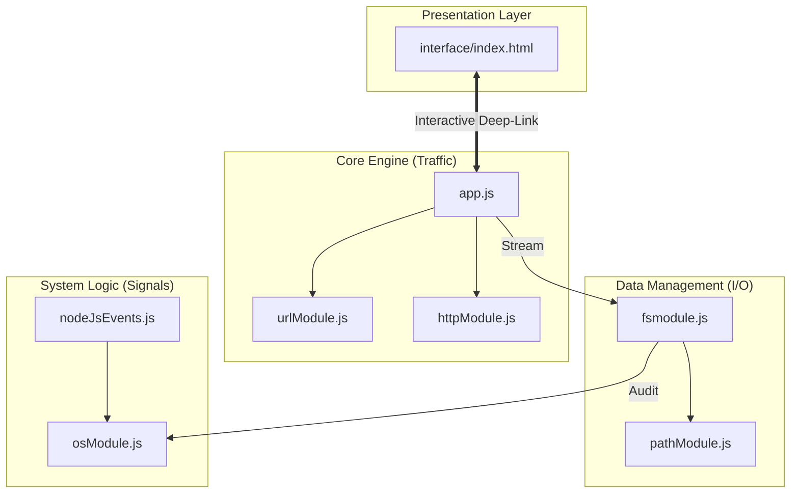

#  Node.js Core Architecture | Backend Mastery


An advanced technical showcase of the **Node.js V8 Runtime**. This repository documents a comprehensive deep-dive into low-level backend engineering—implementing native networking, memory-efficient data streaming, and secure system auditing entirely without third-party frameworks.

🔗 **Live Interactive Dashboard:** [View Technical Portfolio](https://backend-development-five.vercel.app)

---

## Visual Architecture & Data Flow
This diagram illustrates how the different architectural layers interact within the runtime environment.



---

##  📂 Project Directory

```
├── core-engine/              >> [PROTOCOL_LAYER]
│   ├── app.js               # [HTTP/TCP] Routing & Manual Serving
│   ├── httpModule.js        # [REST_CLIENT] Native Stream Consumption
│   └── urlModule.js         # [WHATWG] SearchParams & Security Sanitization
├── data-management/          >> [STORAGE_LAYER]
│   ├── fsmodule.js          # [STREAMS] Buffer-based High-Speed I/O
│   └── pathModule.js        # [SECURITY] Traversal Defense & Normalization
├── system-logic/             >> [RUNTIME_LAYER]
│   ├── nodeJsEvents.js      # [EVENT_BUS] Async Signal Monitoring
│   └── osModule.js          # [HARDWARE] Kernel-level Diagnostics
├── module-system/            >> [ARCH_PATTERNS]
│   ├── Modulefile1.js       # [IMPORT] Dependency Orchestration
│   └── Modulefile2.js       # [EXPORT] Multi-pattern Utility Core
└── interface/                >> [UI_PORTAL]
    └── index.html           # [SPA] Responsive Technical Dashboard
```

---
## Technical Milestones

### 1. Networking & Protocols (core-engine)

Developed a surgical HTTP routing engine from scratch. Mastered the manual request/response cycle, MIME-type parsing, and the implementation of a native API client that processes external data via raw buffer streams.

### 2. Stream-Based I/O (data-management)

Focused on performance engineering. Implemented fs.createReadStream with custom highWaterMark settings to process multi-gigabyte datasets with a constant, near-zero memory footprint, bypassing the limitations of standard readFile buffers.

### 3. Event-Driven Systems (system-logic)

Leveraged custom EventEmitter classes to build decoupled monitoring services. Implemented asynchronous listeners, custom signal triggers, and lifecycle cleanup to ensure maximum runtime stability and prevent memory leaks.

### 4. Security & Sanitization

Engineered a path-resolution auditor to thwart Directory Traversal vulnerabilities and implemented strict WHATWG URL validation standards to secure dynamic redirect logic and query parameter parsing.

---

## Live Deployment Interface

> The live deployment features a Technical Blueprint UI that acts as a bridge between the presentation layer and this codebase.
>
> * **Dynamic Slide Engine:** An automated cycle that rotates through technical focus areas every 4.5 seconds.
> * **Source Inspector:** An integrated feature allowing users to double-click any module box in the 3x3 grid to instantly teleport to the underlying source code on GitHub.
> * **Real-time Analytics:** Includes a live system uptime counter to simulate a production-grade server monitoring environment.

---

## Getting Started

To explore these modules locally, follow these steps:

1. **Clone the repository:**
   ```bash
   git clone https://github.com/ABDUL-RAHMAN-9/Backend-Development.git

2. **Execute the Core Server:**
   ```bash
   node core-engine/app.js

3. **Run Hardware Diagnostics:**
   ```bash
   node system-logic/osModule.js
   
---

## License
Distributed under the **MIT License**. This project is open-source and free to use. 
See the [LICENSE](./LICENSE) for full legal text.

---

## Architected by **[Abdul Rahman](https://github.com/ABDUL-RAHMAN-9)**  
_Principal Backend Explorer | Engineering the core of the modern web._

> "Passionate about building scalable backend solutions and learning the intricacies of Node.js."

