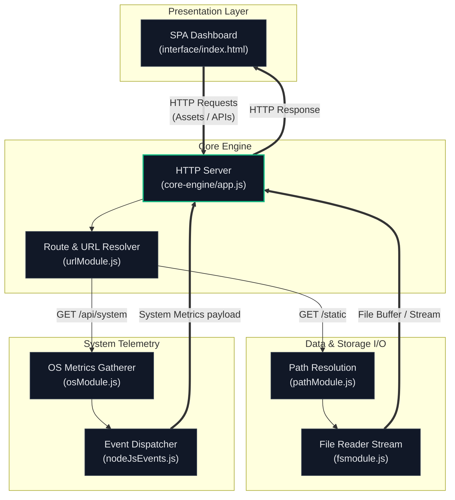

# Node.js Core Architecture


A practical implementation of the Node.js runtime and its native APIs. This repository demonstrates how to build foundational backend systems—including custom HTTP servers, memory-efficient data streams, and system event monitors—relying strictly on native modules without the abstraction of third-party frameworks.

🔗 **Live Interactive Dashboard:** [View Technical Portfolio](https://backend-kernel.vercel.app/)


## System Architecture & Data Flow

The architecture is designed as a modular, event-driven loop. Rather than abstracting system mechanics behind a framework, it separates asset streaming, routing, and system telemetry into decoupled native layers.


```mermaid
graph TD
    classDef default fill:#111827,stroke:#374151,stroke-width:1px,color:#e5e7eb;
    classDef accent fill:#111827,stroke:#10b981,stroke-width:2px,color:#e5e7eb;

    subgraph Presentation ["Presentation Layer"]
        UI["SPA Dashboard<br>(interface/index.html)"]
    end

    subgraph Core ["Core Engine"]
        SRV["HTTP Server<br>(core-engine/app.js)"]:::accent
        RTR["Route & URL Resolver<br>(urlModule.js)"]
    end

    subgraph IO ["Data & Storage I/O"]
        PTH["Path Resolution<br>(pathModule.js)"]
        FS["File Reader Stream<br>(fsmodule.js)"]
    end

    subgraph Diagnostics ["System Telemetry"]
        OS["OS Metrics Gatherer<br>(osModule.js)"]
        EVT["Event Dispatcher<br>(nodeJsEvents.js)"]
    end

    %% Data Flow
    UI ==>|"HTTP Requests<br>(Assets / APIs)"| SRV
    SRV --> RTR
    
    %% Static Asset Path
    RTR -->|"GET /static"| PTH
    PTH --> FS
    FS ==>|"File Buffer / Stream"| SRV
    
    %% System Telemetry Path
    RTR -->|"GET /api/system"| OS
    OS --> EVT
    EVT ==>|"System Metrics payload"| SRV
    
    SRV ==>|"HTTP Response"| UI
```


## Repository Structure

```text
├── core-engine/             # Native HTTP server and routing logic
│   ├── app.js               # Server entry point and file serving controller
│   ├── httpModule.js        # Outbound HTTP client request wrappers
│   └── urlModule.js         # URL parsing, queries, and sanitization
├── data-management/         # Data persistence and secure paths
│   ├── fsmodule.js          # File reads and writes using the 'fs' module
│   └── pathModule.js        # Filepath normalization and path-traversal security
├── system-logic/            # System performance and hardware telemetry
│   ├── nodeJsEvents.js      # Custom event logger using Node's EventEmitter
│   └── osModule.js          # Queries CPU, memory, and OS diagnostics
├── module-system/           # Architectural pattern demonstrations
│   ├── Modulefile1.js       # ES Modules (ESM) import examples
│   └── Modulefile2.js       # ES Modules (ESM) export configurations
└── interface/               # Client-side user interface
    └── index.html           # SPA telemetry and metrics dashboard
```


## Key Implementations & Highlights

### 1. HTTP Server & Routing (`core-engine`)
* **Custom Router:** Built a native routing system that resolves routes and handles incoming requests without standard framework libraries.
* **MIME-Type Parsing:** Parses and serves standard file formats (HTML, CSS, JS, and JSON) with the correct HTTP headers.
* **Native Clients:** Consumes external API endpoints using Node's native HTTP/HTTPS modules.

### 2. Stream-Based I/O (`data-management`)
* **Memory-Efficient Delivery:** Replaced standard `fs.readFile` with native read streams to pipe static assets and log files directly to HTTP responses.
* **Path Sanitization:** Utilizes `path.resolve` and `path.join` to prevent directory traversal attempts and secure file paths against path-hijack vulnerabilities.

### 3. Event-Driven Telemetry (`system-logic`)
* **System Event Bus:** Uses native `EventEmitter` classes to log background processes, request lifecycle events, and runtime diagnostics.
* **Diagnostics Interface:** Extracts operating system metrics (RAM, CPUs, and system load) using the `os` module to send live diagnostic data to the client.


## Live Dashboard Interface

The deployed application acts as a visual blueprint for exploring this codebase directly from the browser.

* **Code-Mapped Explorer:** Double-clicking any system block in the 3x3 UI grid links directly to the corresponding source file on GitHub.
* **Architectural Insights:** Rotates through the different architectural layers to explain their real-time responsibilities.
* **Telemetry Diagnostics:** Displays live server telemetry and system uptime to demonstrate how background diagnostics map to the frontend.


## Local Setup & Execution

To run and explore these native modules locally, follow the steps below:

1. **Clone the repository:**

```bash
git clone https://github.com/abdul-rahman-0x/Backend-Development.git
cd Backend-Development
```

2. **Start the Core HTTP Server:**
```bash
node core-engine/app.js
```
Once the server starts, open your browser and go to http://localhost:3000 to interact with the local dashboard interface.


3. **Run Standalone Diagnostic Modules:**

You can execute and observe individual native modules directly from your terminal:

```bash
node system-logic/osModule.js
```
  

## License

This project is open-source and licensed under the MIT [LICENSE](./LICENSE). Feel free to use, modify, and distribute it.


## Author

**[Abdul Rahman](https://github.com/abdul-rahman-0x)**

